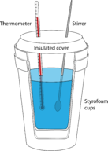

```{r setup, include=FALSE}
library(ggplot2)
knitr::opts_chunk$set(echo = F, fig.pos = "H", fig.align = "center")
```

\textcolor{red}{Please note: Only the parts in red can be the same as your lab partner. All other work should be done individually. While you may have the same results, you should present your material in your own words.  If you take a definition or idea from the internet or text, remember to cite it. For this lab, you can just write: According to, followed by the url.}

\ch{Mg + 2HCl(aq) -> MgCl2(aq) + H2(g)}

# Introduction

*Using at least one reference, describe specific heat and the calorimeter. Explain how we can use the equation to find the enthalpy for the reaction of magnesium with the hydrogen ions in acid. This should be your own work.*

To begin with; a description of specific heat. Technically speaking, specific heat is the amount of heat needed to raise the temperature of 1 gram of a substance by 1 degree Celsius. \cite{usgs} In common lingo, specific heat is the amount of energy needed to heat up a substance; the higher the specific heat capacity, the more energy is required to increase its temperature.\cite{2020} A calorimeter is a device used for calorimetry experiments. There are several different types of calorimeters, but one of the most common and inexpensive calorimeters is a foam cup (this, admittedly, sounds a lot less fancy than a calorimeter), as shown in Figure \ref{fig:calorimeter} from \cite{lumen}. The foam cup is filled with water, and a reaction occurs within the water. This type of experiment is done under the assumption that there is no heat exchange between the inside of the calorimeter and the surrounding environment. \cite{lumen} \par In the context of this experiment, the calorimeter was filled with a hydrochloric acid aqueous solution in lieu of water, though the same concepts apply. In fact, this lab was also conducted with the assumption that the calorimeter contained only water, which was not the case. The whole concept of a calorimetry experiment is to measure the heat exchange between the system and the surrounding. Here, the system is the magnesium and \ch{HCl} ions within the aqueous solution, and the surroundings are the water. Enthalpy is defined as the sum of internal energy and the product of pressure and volume, and in a calorimeter where the pressure is constant, the change in enthalpy, \(\Delta H\), is equal to the heat transfer. \cite{Enthalpy} The heat transfer is calculated using the formula in Equation \eqref{eqn:q}, where \(Q\) is the heat transfer, \(m\) is the mass of the substance, \(c\) is the specific heat capacity of the substance, and \(\Delta t\) is the change in temperature over the course of the reaction. Now, we assume that the transfer of heat in the

\begin{equation}
  Q = mc\Delta t \label{eqn:q}
\end{equation}

```{r calorimeter, fig.cap="A Calorimeter"}

```

# Data Collection

```{r raw-data}
library(kableExtra)
read.csv("./data/raw.csv") %>%
  kbl(booktabs = T, escape = F, caption = "Raw Data", align = "cccccc", position = "H", col.names = linebreak(c("Trial","Mass of the Magnesium \n(+/- 0.01 g)", "Volume of HCl \n(+/- 0.5 mL)", "Concentration of HCl", "Initial Temperature \n(+/- 0.00001 degrees Celsius)","Final Temperature \n(+/- 0.00001 degrees Celsius)"))) %>%
    kable_styling(latex_options = c("striped","scale_down"))
```

## Qualitative Observations

```{r, experiment-1, out.width="10cm", fig.cap="Trial 1 Results"}
library(ggplot2)
experiment <- read.csv("./data/experiment-1.csv")
ggplot(data = experiment) + 
  geom_line(aes(x = time, y = temp)) + 
    labs(x = "Time (seconds)", y = "Temperature (Celsius)")

```

```{r experiment-2, out.width="10cm", fig.cap="Trial 2 Results"}
library(ggplot2)
experiment <- read.csv("./data/experiment-2.csv")
ggplot(experiment) +
  geom_line(aes(x=time, y=temp)) +
    labs(x = "Time (seconds)", y="Temperature (Celsius)")
```

```{r experiment-3, out.width="10cm", fig.cap="Trial 3 Results"}
library(ggplot2)
experiment <- read.csv("./data/experiment-3.csv")
ggplot(experiment) +
  geom_line(aes(x = time, y = temp)) +
    labs(x = "Time (seconds)", y = "Temperature (Celsius)")
```

### Trial 1

With a concentration of 0.5 \si{M}, there was a whitish foam as well as a small amount of bubbles. Note that all of the magnesium reacted.

### Trial 2

With a concentration of 1 \si{M}, there was more foam and fumes than in the first trial. There was no measurable amount of magnesium left after the reaction had ended.

### Trial 3
With a concentration of 2 \si{M}, there was a large amount of fumes and bubbles; much more than when compared to trials one and two.

# Analysis

## Commentary on the Graphs

The first difference I would like to point out is the difference in time before the reaction stabilizes between the three trials. In the first trial, it took around 800 seconds before the reaction came to a stop, as shown in Figure \ref{fig:experiment-1}. Moreover, when we stopped the experiment, there was still magnesium left to react. In the second reaction, it only takes about 250 seconds for the reaction to stabilize, as shown in Figure \ref{fig:experiment-2}. Finally, in experiment 3, it only took about 50 seconds for the reaction to stabilize at a constant temperature, as shown in Figure \ref{fig:experiment-3}. \par

The second comment I would like to make is the difference in stabilization temperature, or rather, the lack thereof. Experiment 1 became stable at `r signif(max(read.csv("./data/experiment-1.csv")[2]), digits = 3)` degrees, while experiment 2 became stable at about `r signif(max(read.csv("./data/experiment-2.csv")[2]), digits = 3)` degrees and experiment 3 became stable at `r signif(max(read.csv("./data/experiment-3.csv")[2]), digits = 3)` degrees. This is a range of about `r signif(max(read.csv("./data/experiment-1.csv")[2]), digits = 3) - signif(max(read.csv("./data/experiment-2.csv")[2]), digits = 3)`.
